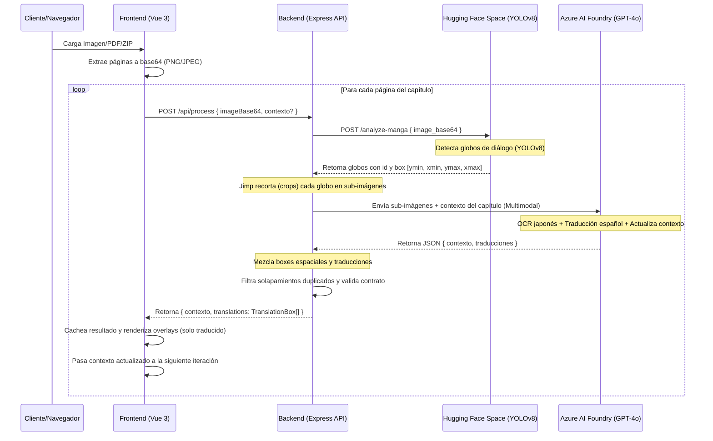
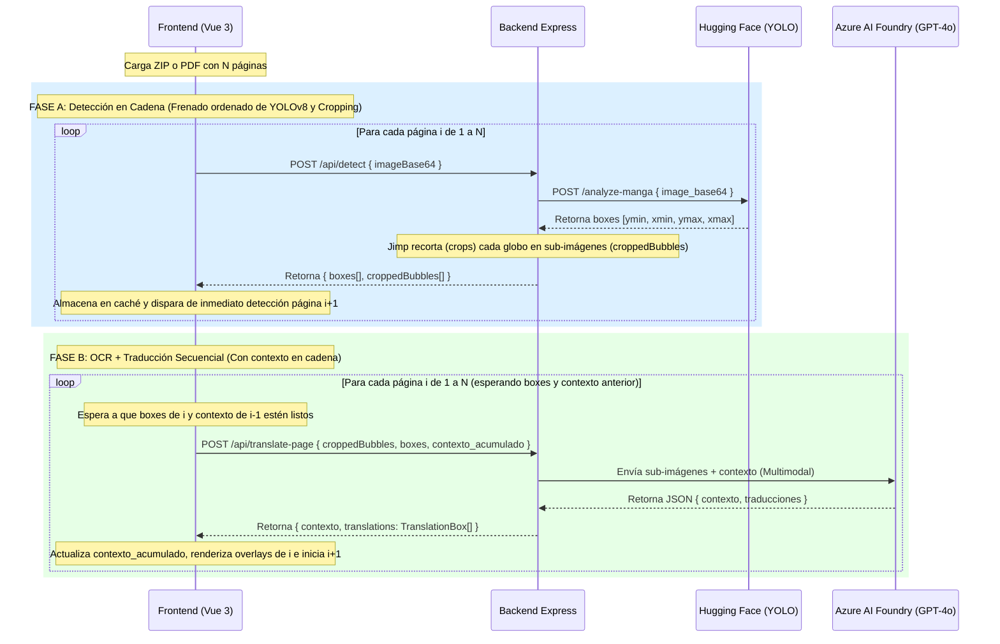

# 🤖 AGENTS.md - Guía de Arquitectura y Estructura del Proyecto para Agentes de IA

Este documento centraliza toda la información técnica, de arquitectura y estructura del proyecto. Su propósito es servir como la **única fuente de verdad** para que los agentes de IA puedan comprender, mantener y expandir el sistema de forma coherente.

---

## 📖 1. Descripción General del Proyecto

**Manga Translate** es un traductor automático de páginas de manga estructurado como un **monorepo**. Su flujo principal automatiza la digitalización, la detección de globos de diálogo, el recorte (cropping) de sub-imágenes, el reconocimiento de texto (OCR) y la traducción al español mediante un pipeline de Inteligencia Artificial de dos fases.

El stack tecnológico principal consiste en:
- **Frontend**: Single Page Application (SPA) responsiva y progresiva (PWA) desarrollada en **Vue 3** + **TypeScript** + **Vite** + **TailwindCSS**.
- **Backend**: API implementada con **Node.js** + **Express.js** + **TypeScript** (preparado para **Azure App Service** u otros hosts de larga duración).
- **Servicios de IA**: Pipeline de detección espacial (YOLOv8) alojado en **Hugging Face Spaces** y un motor OCR+Traducción multimodal (GPT-4o) alojado en **Azure AI Foundry**.

---

## 🏛️ 2. Arquitectura de Alto Nivel y Flujo de Datos

### Flujo de Ejecución E2E (End-to-End)



---

## 📑 3. Contrato de Datos (API Contract)

La superficie de comunicación entre el frontend y el backend está estrictamente tipada y validada en tiempo de ejecución en ambas capas.

### Esquema del Contrato Principal (`TranslationBox` / `TranslationContract`)

Cada elemento representa un globo de diálogo detectado y traducido:

```typescript
export interface TranslationBox {
  id: number;
  box: [number, number, number, number]; // [ymin, xmin, ymax, xmax]
  texto_original: string;
  texto_traducido: string;
}
```

### Regla Crítica de Coordenadas Normalizadas

Para garantizar que la interfaz de usuario sea responsiva a cualquier tamaño de pantalla, las coordenadas de los cuadros (`box`) **siempre están normalizadas en un rango de 0 a 1000** relativo a las dimensiones originales de la imagen:
- `ymin`: Borde superior (0 = inicio de la imagen, 1000 = final de la imagen vertical).
- `xmin`: Borde izquierdo (0 = inicio de la imagen, 1000 = final de la imagen horizontal).
- `ymax`: Borde inferior.
- `xmax`: Borde derecho.

*Ejemplo*: Si una caja está en `[100, 150, 300, 450]`, el frontend interpretará que ocupa del `10%` al `30%` del alto de la imagen y del `15%` al `45%` del ancho de la imagen.

### Endpoints del Backend

Todos los endpoints del backend están configurados en el enrutador de Express (`server.ts`) bajo la ruta base `/api/*`.

1. **`POST /api/process` (Pipeline Completo Legacy)**
   - **Request**: `{"imageBase64": "data:image/jpeg;base64,...", "contexto": "<opcional, contexto del capítulo>"}`
   - **Response (200)**: `{"contexto": "<contexto actualizado>", "translations": TranslationBox[]}`
   - **Response (500/502)**: `{"error": "Detalle del error"}`
   - **Nota**: Ejecuta tanto la detección YOLO como la traducción en una sola transacción secuencial.

2. **`POST /api/detect` (Fase A - Detección, Ordenamiento y Recorte)**
   - **Request**: `{"imageBase64": "data:image/jpeg;base64,..."}`
   - **Response (200)**: `{"boxes": Array<{ id: number, y_min: number, x_min: number, y_max: number, x_max: number }>, "croppedBubbles": Array<{ id: number, base64: string }>}`
   - **Nota**: Retorna las cajas de diálogo ordenadas en secuencia de lectura manga (RTL) y con padding aplicado, junto con las sub-imágenes recortadas en base64 de cada globo.

3. **`POST /api/translate-page` (Fase B - OCR + Traducción Multimodal)**
   - **Request**: `{"croppedBubbles": Array<{ id: number, base64: string }>, "boxes": Array<{ id, y_min, x_min, y_max, x_max }>, "contexto": "<opcional>"}`
   - **Response (200)**: `{"contexto": "<contexto actualizado>", "translations": TranslationBox[]}`
   - **Nota**: Realiza la traducción multimodal en GPT-4o usando las sub-imágenes ya recortadas y limpia los solapamientos duplicados.

4. **`POST /api/vision` (Compatibilidad / Detección Individual)**
   - **Request**: `{"imageBase64": "..."}`
   - **Response**: `{"vision_output": "[{\"id\": 1, \"box\": [...]}]"}` (Respuesta cruda de YOLOv8).

5. **`POST /api/translate` (Compatibilidad / Traducción de Texto)**
   - **Request**: `{"text": "..."}`
   - **Response**: `{"translated": "..."}` (Traducción de texto plano).

6. **`POST /api/warm-up` (Despertador)**
   - **Request**: Ninguno.
   - **Response**: Envía una imagen mínima de 1x1 píxeles a Hugging Face para encender el contenedor remoto si está inactivo (cold-start mitigation).

---

## 📁 4. Mapa del Directorio y Responsabilidades

```text
tp-integrador-ia/
├── .github/workflows/          ← Configuración de GitHub Actions (CI/CD)
│   ├── ci.yml                  ← Corre tests de front y back en cada push/PR
│   └── coverage.yml            ← Generación e integración de cobertura Codecov
├── agents/                     
│   └── AGENTS.md               ← Este documento (fuente de verdad para IAs)
├── frontend/                   ← Aplicación Cliente SPA (Vue 3 + Vite)
│   ├── src/
│   │   ├── main.ts             ← Inicialización y montaje de Vue
│   │   ├── App.vue             ← Componente raíz, orquestación de capítulo y caché
│   │   ├── components/         ← Componentes de UI
│   │   │   ├── ImageUploader.vue     ← Carga de imágenes, PDFs, ZIPs y multi-selección
│   │   │   ├── OverlayRenderer.vue   ← Dibuja las cajas traducidas absolutas + spinner de carga
│   │   │   ├── PageNavigator.vue     ← Navegación entre páginas del capítulo (Anterior/Siguiente)
│   │   │   └── TranslationPanel.vue  ← Barra lateral de búsqueda y navegación
│   │   ├── lib/                ← Lógica auxiliar y compartida
│   │   │   ├── api.ts          ← Cliente HTTP con retry + soporte de contexto
│   │   │   ├── contract.ts     ← Validador de contrato + interfaces (ProcessPageResponse)
│   │   │   └── scale.ts        ← Conversiones de coordenadas [0-1000] ↔ píxeles
│   │   ├── mock/               
│   │   │   └── mock-data.json  ← Datos estáticos para simular la API
│   │   └── __tests__/          ← Suite de pruebas de Vitest
│   ├── tailwind.config.js      ← Configuración de TailwindCSS (soporte oscuro/claro)
│   ├── vite.config.ts          ← Configuración del empaquetador Vite
│   └── vitest.config.ts        ← Configuración de pruebas Vitest + jsdom
├── functions/                  ← API Backend (Node.js + Express)
│   ├── src/
│   │   ├── server.ts           ← Punto de entrada de Express (Inicialización, Middlewares, Rutas)
│   │   ├── process.ts          ← Endpoint de procesamiento (/process) con soporte de contexto
│   │   ├── vision.ts           ← Endpoint de detección (/vision)
│   │   ├── translate.ts        ← Endpoint de traducción (/translate)
│   │   ├── warm-up.ts          ← Endpoint de precalentamiento (/warm-up)
│   │   ├── orchestrator.ts     ← Coordinador del pipeline de IA con contexto acumulativo
│   │   ├── lib/                
│   │   │   ├── azure-client.ts       ← Cliente Azure/HF con prompt contextual para capítulos
│   │   │   ├── image-cropper.ts      ← Recorte físico de sub-imágenes usando Jimp
│   │   │   └── validate-contract.ts  ← Validación estricta del contrato en backend
│   │   └── types/              
│   │       └── contract.ts     ← Interfaces compartidas (TranslationBox, PageProcessResult)
│   └── __tests__/              ← Suite de pruebas de Jest para Node
├── mocks/                      ← Datasets de simulación global
│   ├── ocr-response.json       ← Mock de respuesta de YOLOv8
│   ├── translate-response.json ← Mock de respuesta de GPT-4o
│   └── integration-test-dataset.json  ← Dataset de prueba para integración
└── package.json                ← Mono-repo scripts (setup, dev, build y tests)
```

---

## 🛠️ 5. Detalles Técnicos de Implementación

### 5.1. Mecanismo de Mock Mode (`USE_MOCK_AZURE`)
En el archivo [azure-client.ts](../functions/src/lib/azure-client.ts), si se define la variable de entorno `USE_MOCK_AZURE=true`, el backend omitirá llamadas reales a Hugging Face y Azure AI Foundry. En su lugar:
1. Lee `mocks/ocr-response.json` para obtener los bounding boxes.
2. Lee `mocks/translate-response.json` para emular los textos japoneses y traducciones en español.
3. Devuelve los resultados de manera inmediata e idéntica a una llamada en vivo.

### 5.2. Pipeline de Detección y Recorte (Crop)
1. **Detección Espacial**: [azure-client.ts](../functions/src/lib/azure-client.ts) envía el base64 de la imagen al space de Hugging Face (`/analyze-manga`). Este servicio retorna un array de globos detectados con sus coordenadas `box` normalizadas de 0 a 1000.
2. **Recorte en Memoria**: En [image-cropper.ts](../functions/src/lib/image-cropper.ts), utilizando la librería `Jimp`, se lee el buffer de la imagen original. Se desnormalizan las coordenadas a píxeles absolutos usando las dimensiones de la imagen:
   $$\text{pixel\_x} = \lfloor(\text{xmin}/1000) \times \text{width}\rfloor$$
   $$\text{pixel\_width} = \lfloor((\text{xmax} - \text{xmin})/1000) \times \text{width}\rfloor$$
   Se recortan los fragmentos de la imagen original y se generan sub-imágenes en formato JPEG base64.

### 5.3. OCR y Traducción Multimodal con GPT-4o
En lugar de hacer OCR y luego traducir texto plano, se realiza una sola llamada multimodal en [azure-client.ts](../functions/src/lib/azure-client.ts):
- Se envía a Azure GPT-4o un prompt del sistema instruyéndole comportarse como un motor OCR y traducción.
- El cuerpo del mensaje contiene texto con instrucciones e IDs junto con las imágenes recortadas en base64.
- GPT-4o procesa las sub-imágenes y devuelve directamente una estructura JSON válida que se mapea con los IDs de las coordenadas espaciales detectadas por YOLOv8.

### 5.4. Lógica de Escala del Frontend
1. **Recalcular Escala del Contenedor**: En [App.vue](../frontend/src/App.vue#L179-L192), la función `recalcScale` asegura que el lienzo de la imagen no desborde horizontalmente la pantalla. Calcula el ancho disponible del contenedor padre y establece un factor CSS `scale()` dinámico sobre el contenedor central.
2. **Renderizado de Cajas**: En [OverlayRenderer.vue](../frontend/src/components/OverlayRenderer.vue#L121-L131), la función `styleFromBox` toma el array de coordenadas normalizadas `[ymin, xmin, ymax, xmax]` y calcula porcentajes directos para aplicar estilos inline:
   - `top: ymin / 10%`
   - `left: xmin / 10%`
   - `width: (xmax - xmin) / 10%`
   - `height: (ymax - ymin) / 10%`
   Esto independiza completamente la posición visual del render del tamaño en píxeles del elemento `` subyacente.

### 5.5. Soporte Multi-Página (PDF, ZIP, Multi-Imagen)
El componente [ImageUploader.vue](file:///e:/tmp/tp-integrador-ia/frontend/src/components/ImageUploader.vue) soporta tres formatos de carga:
- **PDF multi-página**: Usa `pdfjs-dist` (versión legacy) para extraer todas las páginas del PDF, renderizándolas sobre Canvas en memoria (máx. 1200×1600 px cada una). Se emite el evento `chapterLoaded` con el array completo de Data URLs.
- **Archivos ZIP**: Usa `jszip` (cargada bajo demanda) para descomprimir el archivo en memoria. Las imágenes se filtran por extensión (`.png`, `.jpg`, `.jpeg`, `.webp`, `.bmp`), se ordenan alfabéticamente y se emiten como capítulo.
- **Selección múltiple de imágenes**: Permite seleccionar varias imágenes del explorador de archivos (HTML5 `<input multiple>`), las ordena por nombre de archivo, y las emite como capítulo.
- Si se sube un solo archivo (imagen o PDF de una página), se mantiene el comportamiento legacy emitiendo `update:imageData`.
- Límite máximo configurable de **50 páginas** por capítulo.

### 5.6. Procesamiento Secuencial con Contexto y Sistema de Cola
Cuando se carga un capítulo, [App.vue](../frontend/src/App.vue) orquesta el procesamiento secuencial utilizando una cola de páginas (`chapterQueue`):
1. El frontend encola los índices de todas las páginas cargadas.
2. Un trabajador asíncrono (`processQueue`) procesa la cola de a una página a la vez. En cada llamada a `POST /api/process` se busca secuencialmente hacia atrás el último contexto válido devuelto por las páginas anteriores.
3. GPT-4o usa el contexto acumulado para mantener la coherencia narrativa (nombres de personajes, tono, eventos).
4. Los resultados exitosos se cachean en un `Map<number, CachedPage>`.
5. Si ocurre un error, se guarda en el caché con los campos `hasError: true`, `errorType` y `errorMessage` para no detener la cola de procesamiento del resto de las páginas.
6. Si el error fue un **timeout o cold start** (detectado por errores 500, 502, 504 o palabras clave relacionadas a Hugging Face), se le muestra al usuario una advertencia y un botón de **Reintentar procesamiento**.
7. Al hacer clic en reintentar, se remueve el error de la caché y se agrega el índice de la página nuevamente a la cola de prioridad `chapterQueue` con prioridad alta (`priority: 1`). Esto asegura que se procese con prioridad inmediata (justo después de que termine la página actualmente en proceso) frente a las páginas restantes de prioridad estándar (`priority: 0`). Si el trabajador no estaba activo, se dispara de nuevo.
8. El cliente HTTP ([api.ts](../frontend/src/lib/api.ts)) implementa reintentos automáticos (máximo 3) con backoff exponencial antes de propagar un fallo al cliente.

### 5.7. Navegación de Páginas
El componente [PageNavigator.vue](file:///e:/tmp/tp-integrador-ia/frontend/src/components/PageNavigator.vue) se instancia en dos ubicaciones de la interfaz (en la parte superior de la página y al pie de la imagen de manga):
- Muestra botones "Anterior" y "Siguiente", indicador "Página X / N", spinner animado y progreso del capítulo.
- Al interactuar con la navegación inferior, la pantalla realiza un scroll suave autónomo (`scrollIntoView`) que enfoca la parte superior de la imagen para facilitar una lectura fluida.

### 5.8. Margen de Seguridad (Padding) y Ordenamiento de Lectura (Recursive XY-Cut)
1. **Margen de Seguridad (Padding)**: Durante la fase de parsing espacial en el backend ([orchestrator.ts](../functions/src/orchestrator.ts)), se expanden las coordenadas de cada caja un 5% de su tamaño original (con un mínimo de 10 unidades sobre la escala 0-1000) en las cuatro direcciones. Esto optimiza el recorte físico para que el OCR no corte caracteres y permite que las cajas de texto en el frontend no queden apretadas.
2. **Recursive XY-Cut (RXYC)**: Para que los globos de diálogo aparezcan ordenados según la secuencia de lectura manga (Derecha a Izquierda, Arriba a Abajo):
   - El backend busca gutters (espacios vacíos continuos) horizontales para dividir el espacio en bloques superior e inferior.
   - Si no los hay, busca gutters verticales para dividir en bloques derecho e izquierdo, leyendo el de la derecha primero (RTL).
   - Si no hay separaciones claras, ordena de arriba a abajo con una tolerancia vertical de 40 unidades (4% del alto) para clasificar de derecha a izquierda los elementos que están en una misma línea.
   - Los globos se reindexan con IDs del `1` al `N` siguiendo este orden antes del recorte, garantizando que tanto las llamadas a GPT-4o como el listado del frontend sigan el flujo narrativo coherente.

### 5.9. Validación y Filtro de Solapamientos (Overlap Cleaning)
Para descartar detecciones duplicadas o burbujas anidadas en el backend ([orchestrator.ts](../functions/src/orchestrator.ts)):
- Se compara cada par de cajas. Si la intersección entre la caja A (más chica) y la caja B cubre más del 70% del área de A:
  - Se limpian los textos japoneses (`texto_original`) de espacios y puntuación.
  - Si el texto limpio de una es una subcadena del otro (o si alguna está vacía por falla de OCR), se descarta la caja pequeña A y se conserva la caja grande B.

### 5.10. Escalado Responsivo de Texto e Interacción Bidireccional
1. **Escalado por Container Queries (Vía CSS/Tailwind)**:
   - El contenedor de la imagen ([OverlayRenderer.vue](../frontend/src/components/OverlayRenderer.vue)) se declara como contenedor de tamaño lineal (`container-type: inline-size`).
   - Se elimina el texto japonés de las cajas en la imagen, mostrando únicamente el texto traducido para maximizar la legibilidad.
   - El tamaño de letra (`font-size`) de cada caja se calcula inline en unidades de contenedor (`cqw`) basándose en una relación matemática entre el área relativa de la caja y el conteo de caracteres. Esto escala de forma fluida y proporcional la tipografía cuando la imagen se redimensiona.
2. **Hover Bidireccional (Dos Vías)**:
   - Posicionar el cursor sobre una caja en la imagen resalta su borde e incrementa su nivel de superposición (`z-10` o `z-20`).
   - Posicionar el cursor en la lista lateral ([TranslationPanel.vue](../frontend/src/components/TranslationPanel.vue)) destaca la caja correspondiente sobre la imagen.
3. **Click-to-Focus y Scroll Autónomo**:
   - Al hacer clic sobre una caja en la imagen, el sistema abre la barra lateral de traducción (si estaba cerrada) y realiza un scroll animado suave (`scrollIntoView`) hacia el botón del listado correspondiente, permitiendo al usuario leer cómodamente el texto completo y su original en japonés si la caja es muy pequeña.

---

## 🔐 6. Configuración de Entorno e Infraestructura

### Variables de Entorno Requeridas

Deben configurarse en un archivo `.env` en el directorio `functions/` o raíz (para desarrollo local con `npm run dev`) o en el panel de despliegue correspondiente (ej. Azure App Service):

| Variable | Descripción | Valor Ejemplo |
|----------|-------------|---------------|
| `AZURE_FOUNDRY_ENDPOINT` | Endpoint base de Azure OpenAI | `https://<recurso>.services.ai.azure.com/api/projects/.../openai/v1/responses` |
| `AZURE_FOUNDRY_API_KEY` | API Key para la autorización en Azure | `FKhk8PQ2ZxcNJXjW4...` |
| `AZURE_FOUNDRY_MODEL_VISION` | Modelo para OCR/Vision (GPT-4o) | `gpt-4o` |
| `AZURE_FOUNDRY_MODEL_TRANSLATE` | Modelo para traducción (GPT-4o) | `gpt-4o` |
| `HF_SPACE_API_URL` | URL del espacio YOLOv8 | `https://coffeebreak03-manga-translate-ocr.hf.space` |
| `USE_MOCK_AZURE` | Bandera para usar mocks en local | `true` o `false` |
| `NODE_ENV` | Entorno de Node.js | `development` o `production` |

---

## 🧪 7. Guía de Testing para Agentes

El repositorio tiene dos suites de pruebas diferenciadas e independientes en cada subdirectorio del monorepo:

### 7.1. Pruebas Unitarias del Frontend (Vitest)
Se ubican en [frontend/src/\_\_tests\_\_/](../frontend/src/__tests__/).
- Utilizan `jsdom` para emular el navegador.
- Archivos clave:
  - `scale.test.ts`: Valida las transformaciones matemáticas en [scale.ts](../frontend/src/lib/scale.ts).
  - `contract.test.ts`: Valida que el parser detecte y rechace payloads ajenos al contrato en [contract.ts](../frontend/src/lib/contract.ts).

### 7.2. Pruebas Unitarias del Backend (Jest)
Se ubican en [functions/\_\_tests\_\_/](../functions/__tests__/).
- Utilizan `ts-jest` para ejecutar pruebas unitarias sobre Node.js.
- Archivos clave:
  - `contract.test.ts`: Valida el parseo y formateo a contrato en backend.
  - `validate-contract.test.ts`: Valida las restricciones físicas de la función `validateTranslationContract`.
  - `orchestrator.test.ts`: Emula el pipeline mediante mocks del cliente Azure y verifica que se llamen en secuencia los dos pasos de visión e traducción.

### 7.3. Integración Continua (CI/CD)
El flujo en `.github/workflows/ci.yml` se ejecuta automáticamente en cada commit de PR e incluye:
1. Instalación paralela de dependencias en `frontend/` y `functions/`.
2. Ejecución secuencial de `npm run test` en ambos subdirectorios.
3. Compilación (build) de ambos proyectos para verificar que no haya fallos de TypeScript.
4. Preparación para el despliegue automático a producción en Azure App Service si los tests pasan exitosamente en la rama `main`.

---

## 🚀 8. Arquitectura Desacoplada: Pipeline Híbrido en Cadena (Pipelined Execution)

Para optimizar el tiempo total de procesamiento de capítulos de manga largos sin sacrificar la coherencia narrativa asistida por contexto, se ha implementado un esquema de ejecución desacoplado (Pipeline en cadena o *Pipelined Execution*):

### Concepto Clave
El pipeline se divide en dos fases asíncronas independientes que corren en paralelo:
1. **Fase A - Detección en Cadena (Pipelined Detection & Cropping):**
   * El cliente realiza peticiones POST `/api/detect` en cadena secuencial para cada página (la detección de la página `i+1` comienza inmediatamente cuando termina la de la página `i`).
   * El backend llama a Hugging Face para obtener las cajas, las ordena y, de inmediato, realiza el **recorte físico (cropping)** usando `Jimp`.
   * El backend retorna tanto las cajas (`boxes`) como las sub-imágenes recortadas (`croppedBubbles`) codificadas en base64. El cliente las almacena temporalmente en su caché.
   * Esto mantiene a Hugging Face ocupado al 100% de manera ordenada, evitando rate-limits (`429`) y sobrecarga de red en el cliente, mientras realiza el procesamiento pesado de imágenes en segundo plano.
2. **Fase B - OCR + Traducción Secuencial (Sequential Translation):**
   * Se procesa de forma secuencial del índice `0` al `N` para encadenar y acumular el contexto narrativo a través de la API de GPT-4o (`/api/translate-page`).
   * La traducción de la página `i` se inicia automáticamente tan pronto como sus coordenadas de detección y burbujas recortadas estén listas y la página anterior `i-1` haya devuelto su contexto (o haya fallado).
   * La petición al backend `/api/translate-page` solo envía los `croppedBubbles` y `boxes`, eliminando la necesidad de volver a transferir la imagen original y acelerando la respuesta al omitir operaciones de procesamiento gráfico en esta etapa crítica secuencial.

### Diagrama del Flujo de Datos



### Ventajas de esta Arquitectura
* **Reducción de Latencia Total:** Al solapar la detección visual y recorte de la página `i+1` (que consume tiempo en Hugging Face y CPU de backend) con la traducción de la página `i` (que consume tiempo en Azure GPT-4o), el tiempo total de procesamiento se reduce significativamente.
* **Preservación del Contexto:** GPT-4o mantiene la máxima coherencia porque la traducción multimodal sigue siendo secuencial e iterativa, heredando el campo `contexto` en orden estricto.
* **Salud del Servidor (HF):** Evita inundar Hugging Face con peticiones en paralelo que causarían bloqueos de tasa `429` o degradación por CPU contention.
* **Resiliencia ante fallos de Traducción:** Si la traducción de una página falla, la ejecución de la cola de traducción **no se detiene**. El pipeline continúa con las páginas siguientes buscando recursivamente hacia atrás en el caché el último contexto exitoso disponible. Esto permite al usuario ver la mayor parte del capítulo traducido e intentar reintentar de manera individual las páginas con error.

